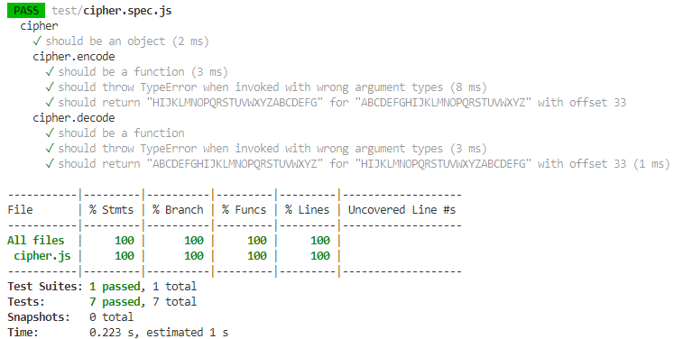
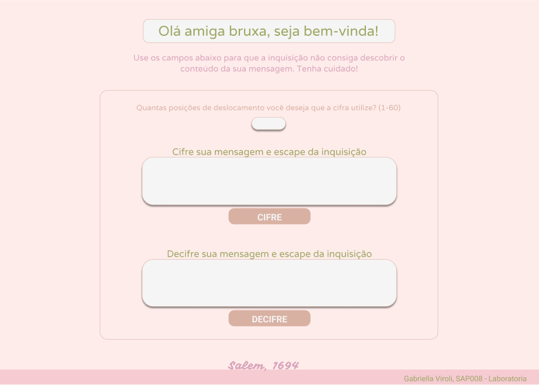

# Cifra de César para Bruxas

## Índice

* [1. Prefácio](#1-prefácio)
* [2. Resumo do projeto](#2-resumo-do-projeto)
* [3. Protótipo inicial](#3-protótipo-inicial)
* [4. Pré requisitos](#4-pré-requisitos)
* [5. Rodando local](#5-rodando-local)
* [6. Deploy](#6-deploy)
* [7. Considerações de aprendizado](#7-considerações-de-aprendizado)

***
## 1. Prefácio

Cifrar significa codificar. A [cifra de César](https://pt.wikipedia.org/wiki/Cifra_de_C%C3%A9sar)
é um dos primeiros tipos de criptografias conhecidas na história.
O imperador romano Júlio César utilizava essa cifra para enviar
ordens secretas aos seus generais no campo de batalha.

A cifra de César é uma das técnicas mais simples de cifrar uma mensagem. É um
tipo de cifra por substituição, em que cada letra do texto original é
substituida por outra que se encontra há um número fixo de posições
(deslocamento) mais a frente do mesmo alfabeto.

Por exemplo se usarmos o deslocamento (_offset_) de 3 posições:

* Alfabeto sem cifrar: A B C D E F G H I J K L M N O P Q R S T U V W X Y Z
* Alfabeto com cifra:  D E F G H I J K L M N O P Q R S T U V W X Y Z A B C
* A letra A será D
* A palavra CASA será FDVD

***
## 2. Resumo do projeto

Projeto criado durante o Bootcamp da Laboratória. Neste projeto você poderá cifrar e decifrar um texto indicando a chave de deslocamento (_offset_). 
A temática escolhida foi baseada em ficção e fantasia e se baseia nas Bruxas de Salém. As bruxas de Salém podem cifrar
mensagens para que não sejam  pegas pela inquisição utilizando esta aplicação web. 
A aplicação irá interagir com o usuário final através do navegador 
utilizando HTML, CSS e JavaScript como ferramentas. A interface permite que o usuário: 

* Eleja um _offset_ indicando quantas posições de deslocamento de caracteres
  quer que a cifra utilize.
* Insira uma mensagem (texto) para ser cifrada.
* Veja o resultado da mensagem cifrada.
* Insira uma mensagem (texto) para ser decifrada.
* Veja o resultado da mensagem decifrada.

Nesse projeto não foi permitido usar bibliotecas ou frameworks, só vanilla 
JavaScript. O projeto foi concluído com 100% de cobertura de testes (eslint, htmlint e jest)

***
## 3. Protótipo inicial 

Através [desse link](https://www.figma.com/file/824wTB3IrJbnaCWNVHMemR/Projeto-1-Laborat%C3%B3ria%3A-Caesar-Cipher?node-id=0%3A1) você pode acessar o protótipo de baixa fidelidade 
deste projeto, desenvolvido através da ferramenta Figma. Durante o percurso do projeto tomei a decisão de simplificar o design pois ainda não tinha neste momento o conhecimento de HTML e CSS nivelado com o protótipo que havia feito inicialmente, após diversas alterações fiquei satisfeita com o resultado, apesar da diferença entre os dois.

***
## 4. Pré requisitos 

* Linux ou semelhante (git bash, wsl, etc)
* Node >= 14.x

***
## 5. Rodando local

* Após clonar o repositório, execute o comando `npm install` para instalar as dependências do projeto. 
* Feito isso, execute o comando `npm start` 

Ao final disso você deve ter no console uma tela exibindo localhost:3000. Através desse link você acessará o projeto. 

***
## 6. Deploy

* Execute o comando `npm run deploy` para criar a branch de deploy
* Acesse as configurações do seu repositório
* Acesse a aba Pages 
* configure para usar a branch `gh-pages` com root e salve

O GitHub pode levar até 20 minutos para atualizar a sua page.

***
## 7. Considerações de aprendizado 

Durante este projeto na Laboratória pude estudar, entender e praticar alguns conceitos de lógica de programação, JavaScript, HTML e CSS. Dentro deles, destaco: 

* Uso de HTML semântico
* Uso de seletores de CSS
* Uso de seletores de DOM
* Manipulação de eventos de DOM
* Manipulação dinâmica de DOM
* Uso de condicionais (if-else, switch, operador ternário)
* Uso de laços (for, for..of, while)
* Uso de funções (parâmetros, argumentos, valor de retorno)
* Testes unitários 
* Git e GitHub (instalação e configuração, controle de versão com git, criação de contas e repositórios, implantação com GitHub Pages) 
* UX e UI Design 
* User-centricity: Desenhar a aplicação pensando e entendendo a usuária
* Product-design: Criar protótipos para obter feedback e iterar
* Aplicar os princípios de desenho visual (contraste, alinhamento, hierarquia)
